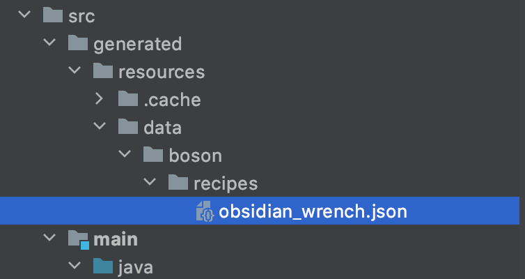

# Data Generator

在这节中，我们将要来学习一个在1.14+之后出现的非常方便开发的功能：Data Generator。

在之前的开发过程中，你是不已经厌倦了不断写着基本上重复的JSON文件以及自己粗心犯下的错误呢？

而Data Generator就是一个Minecraft本身提供的功能，能让你通过代码，相对自动的生成这些JSON文件。

在这节中我将以合成配方作为例子，但是Data Generator的使用范围绝对不限于配方。

首先我们需要订阅`GatherDataEvent`事件，这个事件就是Data Generator的入口。

```java
@Mod.EventBusSubscriber(bus = Mod.EventBusSubscriber.Bus.MOD)
public class DataGenEvent {
    @SubscribeEvent
    public static void dataGen(GatherDataEvent event) {
        event.getGenerator().addProvider(new Recipes(event.getGenerator()));
    }
}
```

可以看到，这里我们调用了`event.getGenerator().addProvider`方法传入了一个`IDataProvider`接口的实例，关于`Recipes`类的具体实现我们之后再说。我们先来说说`IDataProvider`，`IDataProvider`是每种DataGenerator必须要实现的借口，如果你想要实现一种新的Data Generator，你可以也可以自己实现这个接口，基本上就是要实现一个把某个数据结构序列化成JSON格式。但是幸运的是，Minecraft本身和Forge都提供了一系列的对应实现，我们拿来就可以用，具体有哪些实现，你可以看`IDataProvider`接口的继承树。

```java
public class Recipes extends ForgeRecipeProvider {
    public Recipes(DataGenerator generatorIn) {
        super(generatorIn);
    }

    @Override
    protected void registerRecipes(Consumer<IFinishedRecipe> consumer) {
        ShapedRecipeBuilder.shapedRecipe(ItemRegistry.obsidianWrench.get())
                .patternLine("III")
                .patternLine(" G ")
                .patternLine(" G ")
                .key('I', Items.IRON_INGOT)
                .key('G', Items.GOLD_INGOT)
                .addCriterion("iron_ingot", InventoryChangeTrigger.Instance.forItems(Items.IRON_INGOT, Items.GOLD_INGOT))
                .build(consumer);
    }
}
```

可以看到我们这里我们直接继承了Forge提供的`ForgeRecipeProvider`。对于`ForgeRecipeProvider`类来说，你需要复写`registerRecipes`方法，并且在这个方法里构建你的配方，如果你熟悉配方的JSON写法，那么看到这些代码应该不会觉得难以理解。

请注意`.addCriterion`这个方法虽然没什么用，但是是必须要添加的。

那么如何使用Data Generator呢？

首先你得先在你的`build.gradle`中，找到。

```groovy
data {
  workingDirectory project.file('run')
  // Recommended logging data for a userdev environment
  property 'forge.logging.markers', 'SCAN,REGISTRIES,REGISTRYDUMP'
  // Recommended logging level for the console
  property 'forge.logging.console.level', 'info'
  args '--mod', 'boson', '--all', '--output', file('src/generated/resources/')
  mods {
    boson {
      source sourceSets.main
    }
  }
}
```

然后讲 `args`这行中的`--mod` 之后的`'examplemod'`改成你的modID，在我们的例子里就是`'boson’`，之后的`—ouput`对应的是自动生成的文件的目录，这里我们保持默认，修改完成后重新运行`genIntelliJRuns`这个task。

然后再像你正常启动游戏一样运行`runData`这个配置项。


如果代码没有出错的话，等运行结束，你就能在你的`src`目录下看见自动生成的JSON文件了。



接下去你可以直接复制使用这些JSON文件，或者在`build.gradle` 里在`sourceSets`里添加对应的目录使用，具体这里就不详细展开了。

[源代码](https://github.com/FledgeXu/BosonSourceCode/tree/master/src/main/java/com/tutorial/boson/datagen)

