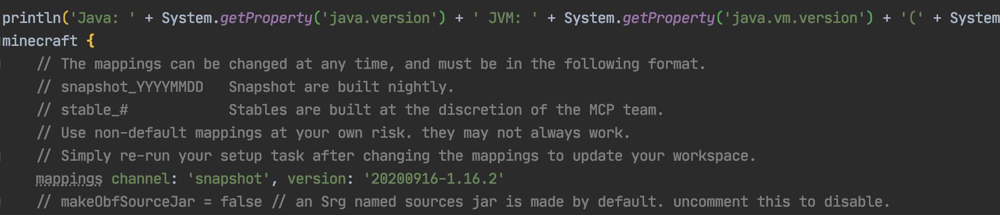
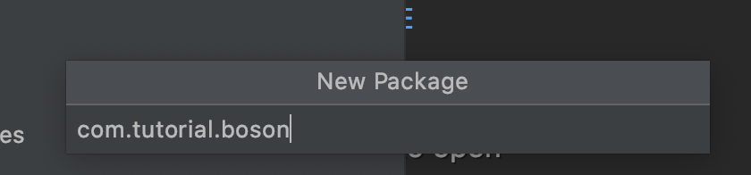
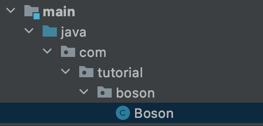

# 自定义mod信息

从这节起我们就会开始正式的写我们mod了！

## 更新Mappings

**Forge的Mapping系统正在迁移的过程中，关于mapping文件的内容等MMS系统发布之后将会更新，我们目前使用的版本是`20200916-1.16.2`**

我们需要将`build.gradle`下的`mappings channel: 'snapshot', version: '20200514-1.16’`修改为`mappings channel: 'snapshot', version: '20200916-1.16.2’`。



然后点击右侧Gradle面板的重新导入按钮，重新导入项目，因为`build.gradle`文件非常的重要，请注意不要改错。


这个过程可能会涉及下载文件（但不会很多），有出现错误的可能性，出错了请检查你的`build.gradle`内容有没有填错，然后多试几次。

## 配置

首先我们选中`java`文件夹下所有的目录和文件，然后右键删除Java包下的默认类。


然后再右键新建立一个包

在默认情况下你的包名应该是你的域名的倒写，因为我不想用自己的域名举例子，所以这里我填入的内容是`com.tutorial.boson`。





创建完成以后右击创建一个Java类，名字叫做`Boson`，请注意大小写，在默认情况下Java的类名遵循「帕斯卡命名法」。



这个`Boson`就是我们Mod的主类。

接下来创建一个`Utils`类，用来放置一些全局的常量。

创建完成后目录树如下：

```
java
└── com
    └── tutorial
        └── boson
            ├── Boson.java
            └── Utils.java
```

接下来我们去`Utils`类里定义一下我们的`modid`，那么什么是你的`modId`呢？`modId`就是你mod名字的唯一标识符，请注意`modId`和你的mod名字不是同一个东西，它不允许大写字母，也不允许空格等内容。在这里我们选用的`modId`是`boson`。

```java
public class Utils {
    public static final String MOD_ID = "boson";
}
```

然后进入`Boson`在类名的上方添加一个`@Mod()`注解，里面加入我们之前定义好的`modid`。添加完成后内容如下:

```java
import net.minecraftforge.fml.common.Mod;

@Mod(Utils.MOD_ID)
public class Boson {
}
```

接下来我们需要去修改处于`resources/META-INF`下的`mods.toml`。在默认情况下IntelliJ是没有对Toml文件语法高亮的，如果你需要像我一样的语法高亮可以去安装一个`Toml`插件。

`mods.toml`是我们mod信息的配置文件，在这里我们可以修改我们mod的名字，介绍等内容。其中有许多配置项，如果一个配置项的注释里含有`#mandatory`说明这个配置项是必须的，如果注射里写的的是`#optional`，说明这个配置项是可选的，你可以在配置项前面加上`#`来注释掉这个配置项。

|     配置项      |                        作用                         |
| :-------------: | :-------------------------------------------------: |
|    modLoader    |       规定mod的Loader，大部分情况下不需要修改       |
|  loaderVersion  |  规定了mod运行的Forge版本，大部分情况下不需要修改   |
|     license     |           必填，这里填入的是你的Mod许可证           |
| issueTrackerURL |         可选，你的Mod Bug提交地址，按需修改         |
|      modId      | 必填，这里需要填入你的`modId`，和代码中的要保持一致 |
|     version     |            必填，一般情况下保持默认即可             |
|   displayName   |     必填，显示名称，你的mod在Mod界面的显示名称      |
|  updateJSONURL  |               可选，你的mod的更新链接               |
|   displayURL    |             可选，你的mod介绍网页的链接             |
|    logoFile     |                 可选，你的Mod的Logo                 |
|     credits     |               可选，你的Mod的致谢名单               |
|     authors     |               可选，你的mod的作者名单               |
|   description   |            必填，你的mod在mod界面的介绍             |

接下剩下的都是依赖，Forge官方的例子已经写的很清楚了，这里我们不多加说明

我修改完的`mods.toml`如下:

```toml
modLoader="javafml" 
loaderVersion="[34,)" 
license="GNU GPLv3"
[[mods]]
modId="boson" 
version="${file.jarVersion}" 
displayName="Boson"
authors="FledgeShiu" 
description='''
This is Boson, the 1.16 Modding tutorial example mod.
'''
```

现在我们已经修改完我们的mod信息了，现在让我打开游戏。


可以看见我们的Mod已经出现了！

