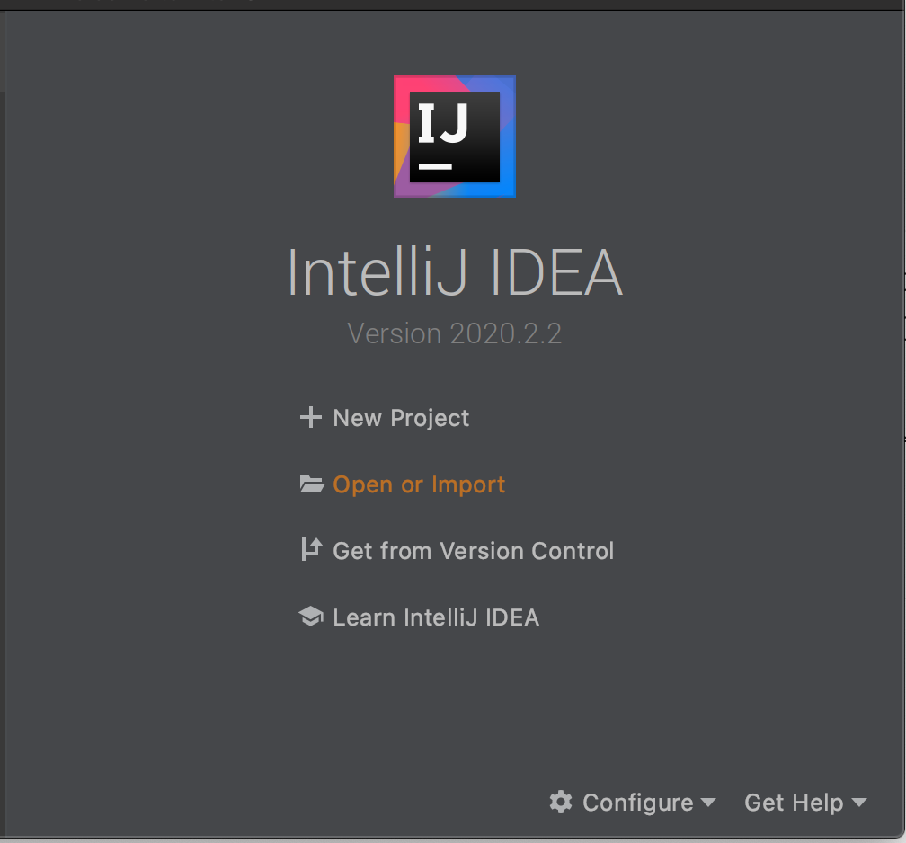
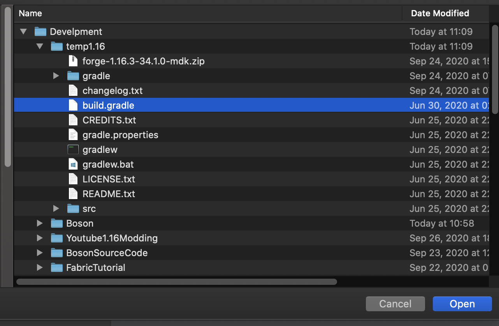
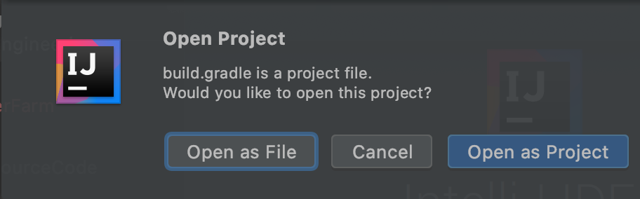
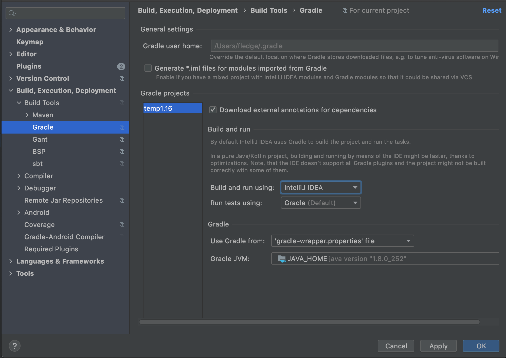
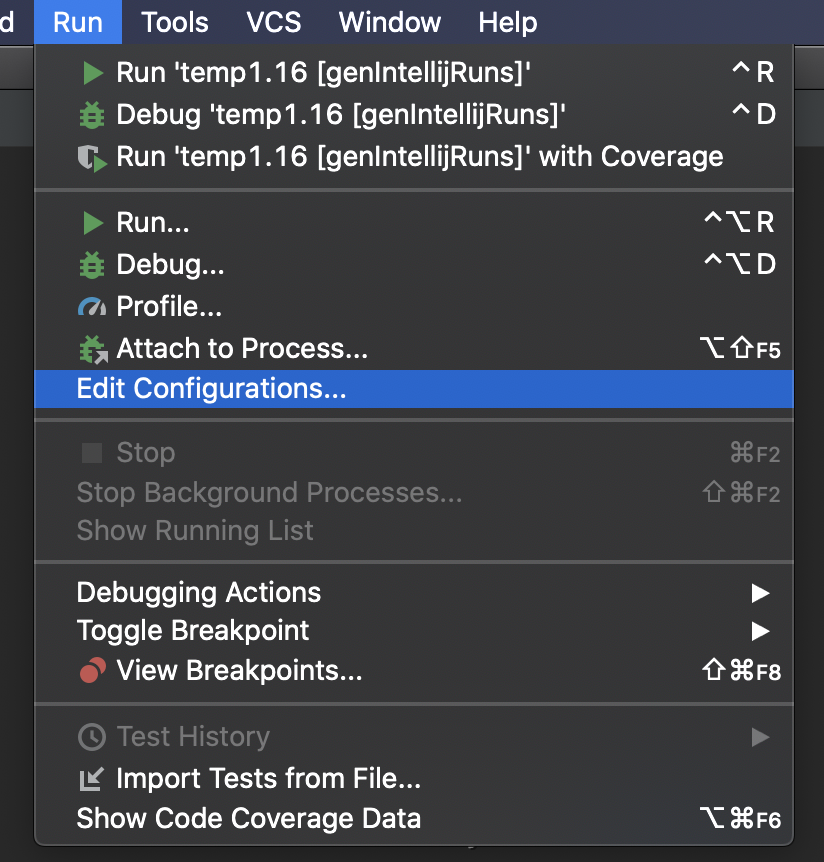
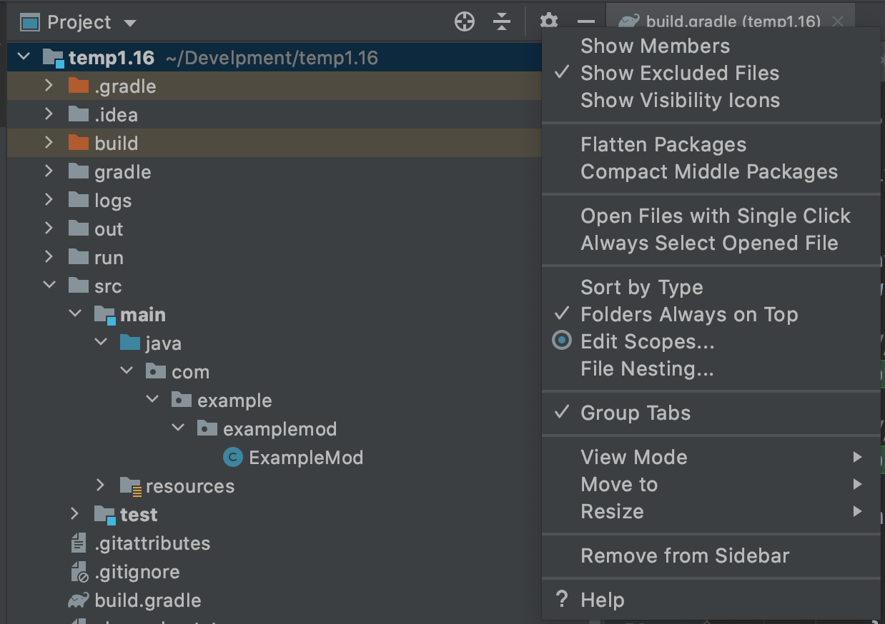
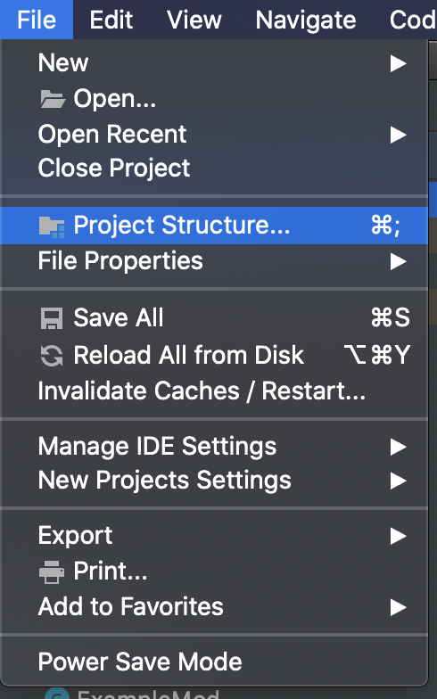

# Forge开发环境的配置

## 需要的工具

-  [AdoptOpenJDK8-HotSpot](https://adoptopenjdk.net/?variant=openjdk8&jvmVariant=hotspot)，出于兼容性的考虑，**请确保你安装的是JDK8**。
- [IntelliJ IDEA 2020 社区版](https://www.jetbrains.com/zh-cn/idea/download/)，下载完成后请自行安装，介于目标读者的水平，这里有个如何给2020.1之后的版本安装官方中文的[教程](https://www.bilibili.com/video/BV1NT4y137nb)。

- [Forge MDK 1.16.3 34.1.0](https://adfoc.us/serve/sitelinks/?id=271228&url=https://files.minecraftforge.net/maven/net/minecraftforge/forge/1.16.3-34.1.0/forge-1.16.3-34.1.0-mdk.zip)，下载后请解压到你喜欢的文件夹，请注意这里的解压文件夹不要包括任何的中文、空格以及一些特殊符号（比如「！」）。

**注意，介于预想读者的水平，配置过程十有八九是会失败的，建议直接使用[ForgeGradleCN(推荐)](https://v2mcdev.com/t/topic/589)或者[离线包](https://v2mcdev.com/t/topic/249/2)，配置完ForgeGradleCN后继续进行之后的步骤**

## 总体的介绍

Minecraft Forge是一个Gradle项目，Gradle是一个项目构建工具，其主要作用是负责项目的依赖管理、构建等功能。依赖管理指的是帮你自动地下载和配置你开发中使用的库，也就是别人写好的方便你自己开发的代码。构建指的是将你写的mod打包成别人可以安装的jar文件。

Forge官方写了一个叫做ForgeGradle（以后简称FG）的插件来负责整个mod开发环境的配置（~~为什么要说这个呢，让你知道当环境配置失败时该骂谁~~)。

## 开始配置

**在开始配置前，非常建议使用官方启动器启动一遍1.16.3版本的游戏，这样可以减少配置环境过程中的网络下载，加速环境配置的速度和成功率**

首先选择启动页面的`Open or Import`。

选择你MDK解压目录下的`build.gradle`打开。

选择作为`Open As Project`

打开之后，根据你网络和自身电脑的情况，会有或长或短的导入时间，这个过程需要下载很多的依赖包，而这些依赖包都存放在海外，介于中国大陆网络封锁，导致海外网络访问不稳定，这个时间将会持续几分钟至几天不等，而且很有可能失败，对于有代理的读者可以自行搜索「Gradle配置代理」来给Gradle加上代理，对于没有代理的读者，可以使用上文提到过的`ForgeGradleCN`。

当导入结束，点击下方的`build`面板，左侧显示绿勾时说明导入成功。

再进行下一步前，我建议先调整一下IntelliJ关于Gradle的设置，用来加快之后的游戏启动速度。

打开IntelliJ的设置界面，找到`Gradle`标签页，将`Build and using`从`Gradle`改为`IntelliJ IDEA`，点击`Apply`保存。

默认情况下MDK设置的日志等级是`debug`等级，这个日志等级输出内容过于多了，不方便我们开发中查看日志，建议调整成`info`等级。

打开你的`build.gradle`文件，将里面所有的`property 'forge.logging.console.level', ‘debug’`改成`property 'forge.logging.console.level', ‘info’`。

设置完成后，点击运行右侧的`Gradle`面板，选择其中的`Tasks`下`fg_runs`下的`genIntelliJRuns`。

在这一步中，会自动下载剩余的一些依赖，以及Minecraft的资源文件。如果你之前有用官方启动器启动过对应版本的Minecraft，在这个过程中会自动复制本地的缓存，将大幅度的减少下载时间。如果这个过程中出现了错误，基本上重新运行`genIntelliJRuns`就能解决。

同样的当左侧显示「绿勾」时说明配置成功。

点击上方的`Run=>Edit Configurations`。

选择`Application`下的三项，删去`Before Launch`除了`Build`之外的所有任务

然后选择`runClient`即可启动游戏。

可以看见我们的游戏成功启动了，如果你之前按照教程调整过Gradle的设置，启动速度应该不会很慢。

为了之后创建目录和子包的方便，按照下图将「拼合包」和「压缩空的中间包」取消选择。

## JDK常见错误

如果你的电脑里有多个JDK，有可能IntelliJ自动选择的JDK是错误的，导致无法导入，你需要手动修改项目的JDK和Gradle运行所需要的JDK。

选择`File`下的`Porject Strucutre`。

将项目JDK改成1.8版本

