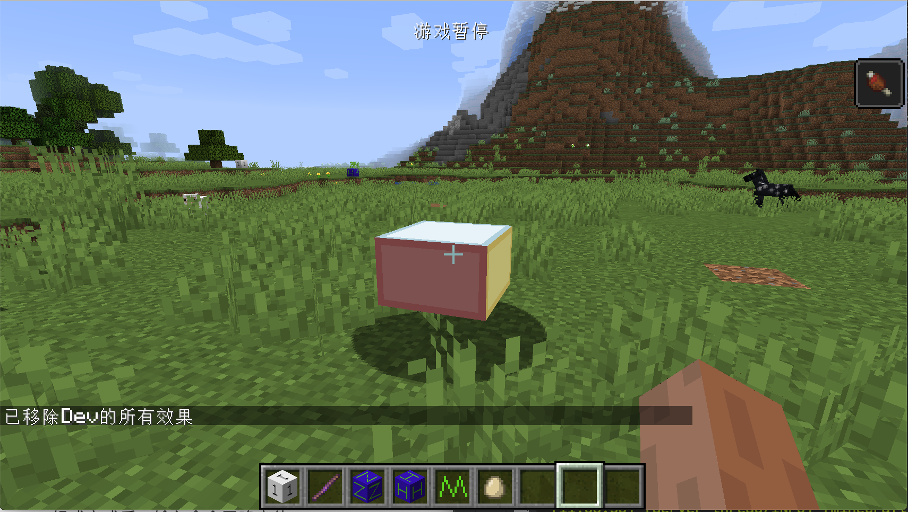

# 创建一个动物和AI

虽然上节中，我们从零创建了一个最简单的实体，但是其实你在写mod的大部分时候都不需要直继承`Entity`类，原版已经写好了非常多的类供你使用。在这节中我们将创建一个黑曜石动物，并且为这个动物添加一个AI和**属性**。

这里就引出的第一个问题，什么是AI？AI代表着生物的特殊的行为，比如牛会被玩家用小麦吸引，怪物会攻击玩家，会在村庄里走来走去。这些都是通过AI实现的，请注意不是所有的实体都可以有AI，AI是`MobEntity` 的子类特有的行为。

这里的第二个问题就是什么是**属性**，你可以把属性当作每一个存在游戏中的实体各自独立的「配置文件」，这个「配置文件」的值存放在每个实体的NBT标签里，你可以通过调整「配置文件」里的值来修改实体的默认的血量，移动速度等。

首先我们来创建我们的实体类，`ObsidianAnimal`：

```java
public class ObsidianAnimal extends AnimalEntity {
    public ObsidianAnimal(EntityType<? extends AnimalEntity> type, World worldIn) {
        super(type, worldIn);
        this.goalSelector.addGoal(0, new ObsidianGoal(this));
        this.getAttributeManager().createInstanceIfAbsent(Attributes.MAX_HEALTH);
    }

    @Override
    public AgeableEntity func_241840_a(ServerWorld p_241840_1_, AgeableEntity p_241840_2_) {
        return null;
    }
}
```

可以看见内容非常简单，甚至比我们第一个实体的内容还要简单。我们先来看：

```java
@Nullable
@Override
public AgeableEntity createChild(AgeableEntity ageable) {
  return null;
}
```

这个方法是用来创建后代用的，因为我们的动物并并没有后代，所以这里就返回空即可。

然后我们来看构造方法。

```java
protected ObsidianAnimal(EntityType<? extends AnimalEntity> type, World worldIn) {
  super(type, worldIn);
  this.goalSelector.addGoal(0, new ObsidianGoal(this));
  this.getAttributeManager().createInstanceIfAbsent(Attributes.MAX_HEALTH);
}
```

在这里我们调用` this.goalSelector.addGoal`方法为我们的实体添加了一个AI或者说Goal（目的），而我们用`this.getAttributeManager().createInstanceIfAbsent(Attributes.MAX_HEALTH);`为我们的实体添加了一个属性，请注意`Attributes.MAX_HEALTH`这个属性是必须要添加的。

`ObsidianGoal`:

```java
public class ObsidianGoal extends Goal {
    private final ObsidianAnimal obsidianAnimal;

    public ObsidianGoal(ObsidianAnimal obsidianAnimal) {
        this.obsidianAnimal = obsidianAnimal;
    }

    @Override
    public boolean shouldExecute() {
        World world = this.obsidianAnimal.getEntityWorld();
        if (!world.isRemote) {
            BlockPos blockPos = this.obsidianAnimal.getPosition();
            PlayerEntity player = world.getClosestPlayer(blockPos.getX(), blockPos.getY(), blockPos.getZ(), 10, false);
            if (player != null) {
                player.addPotionEffect(new EffectInstance(Effects.HUNGER, 3 * 20, 3));
            }
        }
        return true;
    }
}
```

在默认情况下`Goal`的对构造方法是没有什么要求的，但是在大多数时候，你都应该在构造方法，将实体的实例传递进来并保存，这样会方便你实现实体的AI。`shouldExecute`是`Goal`最为重要的方法，这里就是调用你实体AI的地方，这里我们的AI非常简单，就是给靠近实体的玩家一个饥饿效果，实现原理和我们之前实现的会播放僵尸吼叫声的方块原理是一样的，这里就不加赘述了。

看完了AI，接下来的我们来看看属性的注册。

```java
@Mod.EventBusSubscriber(bus = Mod.EventBusSubscriber.Bus.MOD)
public class AttributesSetEvent {
    @SubscribeEvent
    public static void setupAttributes(FMLCommonSetupEvent event) {
        event.enqueueWork(() -> {
            GlobalEntityTypeAttributes.put(EntityTypeRegistry.obsidianAnimal.get(), MobEntity.func_233666_p_().createMutableAttribute(Attributes.MAX_HEALTH, 10.0D).create());
        });
    }
}
```

可以看到，我们在`FMLCommonSetupEvent`这个事件中为我们的实体添加了属性，请注意这里的内容必须要放在`event.enqueueWork`中。

`GlobalEntityTypeAttributes.put`有两个参数，第一个参数是`EntityType`而第二个就是这个实体应该有哪些属性，以及这些属性的默认值是什么，这里我们调用了`createMutableAttribute`添加了一个属性即我们之前提到的`Attributes.MAX_HEALTH`，并且设置了默认值是`10`，这样我们的生物默认就是10点的血量。

然后是模型`ObsidianAnimalModel`:

```java
public class ObsidianAnimalModel extends EntityModel<ObsidianAnimal> {
    private final ModelRenderer body;

    public ObsidianAnimalModel() {
        textureWidth = 64;
        textureHeight = 64;

        body = new ModelRenderer(this);
        body.setRotationPoint(8.0F, 24.0F, -8.0F);
        body.setTextureOffset(0, 0).addBox(-16.0F, -16.0F, 0.0F, 16.0F, 10.0F, 16.0F, 0.0F, false);
    }

    @Override
    public void setRotationAngles(ObsidianAnimal entityIn, float limbSwing, float limbSwingAmount, float ageInTicks, float netHeadYaw, float headPitch) {
    }

    @Override
    public void render(MatrixStack matrixStackIn, IVertexBuilder bufferIn, int packedLightIn, int packedOverlayIn, float red, float green, float blue, float alpha) {
        body.render(matrixStackIn, bufferIn, packedLightIn, packedOverlayIn);
    }
}
```

可以看到我们的模型也就是一个普通的方块而已。

然后是渲染

```java
public class ObsidianAnimalRender extends MobRenderer<ObsidianAnimal, ObsidianAnimalModel> {

    public ObsidianAnimalRender(EntityRendererManager renderManagerIn) {
        super(renderManagerIn, new ObsidianAnimalModel(), 1F);
    }

    public ObsidianAnimalRender(EntityRendererManager renderManagerIn, ObsidianAnimalModel entityModelIn, float shadowSizeIn) {
        super(renderManagerIn, entityModelIn, shadowSizeIn);
    }

    @Override
    public ResourceLocation getEntityTexture(ObsidianAnimal entity) {
        return new ResourceLocation(Utils.MOD_ID, "textures/entity/obsidian_animal.png");
    }
}
```

这里我们直接继承了`MobRenderer`来自动的渲染一些类似于影子的东西。之所以这里有两个构造函数是因为，当我们注册Render的时候，Lambda表达式里只给了一个参数，虽然你也可以把预设的内容写在Lambda表达式里，但是如果你那样干了就没法简化代码了，所以我们这里就额外添加了一个构造函数。

这里构造函数的第二个参数是你的动物的模型，第三个参数是影子的大小。

别忘了注册你的实体和你的Render。

组成完成后，输入命令召唤实体。



可以看到，当你靠近实体时，你就获得了一个饥饿效果，试试用剑杀死它吧。

[源代码](https://github.com/FledgeXu/BosonSourceCode/tree/master/src/main/java/com/tutorial/boson/obsidian_animal)

