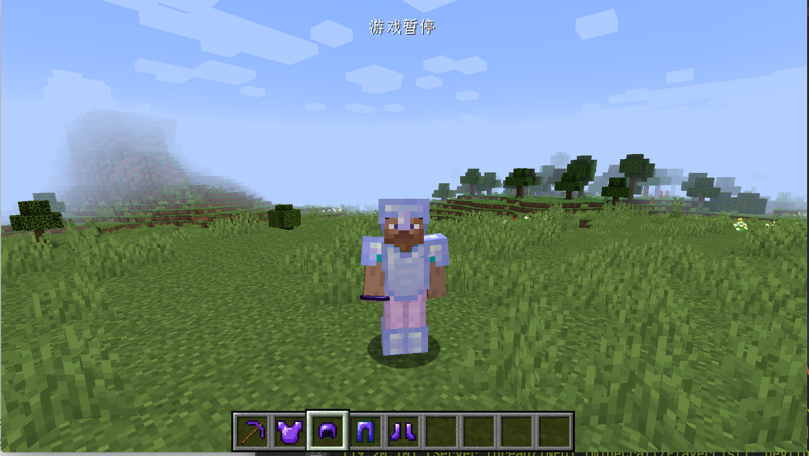

# 装备

在这节中，我们将来学习如何添加一套装备，这里我们以黑曜石装备为例。

和工具与武器一样，装备也有它的等级，也就是`IArmorMaterial`，这里我们仿照原版的做法，用一个Enum实现这个接口。

```java
public enum ModArmorMaterial implements IArmorMaterial {
    OBSIDIAN("obsidian", 40, new int[]{5, 8, 10, 5}, 20, SoundEvents.ITEM_ARMOR_EQUIP_DIAMOND, 2.0F, 0.0F, () -> {
        return Ingredient.fromItems(ItemRegistry.obsidianIngot.get());
    });

    private static final int[] MAX_DAMAGE_ARRAY = new int[]{13, 15, 16, 11};
    private final String name;
    private final int maxDamageFactor;
    private final int[] damageReductionAmountArray;
    private final int enchantability;
    private final SoundEvent soundEvent;
    private final float toughness;
    private final float knockbackResistance;
    private final LazyValue<Ingredient> repairMaterial;

    ModArmorMaterial(String name, int maxDamageFactor, int[] damageReductionAmountArray, int enchantability, SoundEvent soundEvent, float toughness, float knockbackResistance, Supplier<Ingredient> repairMaterial) {
        this.name = name;
        this.maxDamageFactor = maxDamageFactor;
        this.damageReductionAmountArray = damageReductionAmountArray;
        this.enchantability = enchantability;
        this.soundEvent = soundEvent;
        this.toughness = toughness;
        this.knockbackResistance = knockbackResistance;
        this.repairMaterial = new LazyValue<>(repairMaterial);
    }

    public int getDurability(EquipmentSlotType slotIn) {
        return MAX_DAMAGE_ARRAY[slotIn.getIndex()] * this.maxDamageFactor;
    }

    public int getDamageReductionAmount(EquipmentSlotType slotIn) {
        return this.damageReductionAmountArray[slotIn.getIndex()];
    }

    public int getEnchantability() {
        return this.enchantability;
    }

    public SoundEvent getSoundEvent() {
        return this.soundEvent;
    }

    public Ingredient getRepairMaterial() {
        return this.repairMaterial.getValue();
    }

    @OnlyIn(Dist.CLIENT)
    public String getName() {
        return this.name;
    }

    public float getToughness() {
        return this.toughness;
    }

    public float getKnockbackResistance() {
        return this.knockbackResistance;
    }
}
```

请注意这里的`name`，这个和之后我们要创建的玩家穿戴在身上的材质相关。

接下来直接创建相对应的装备就行。

```java
public static final RegistryObject<Item> obsidianHelmet = ITEMS.register("obsidian_helmet", () -> new ArmorItem(ModArmorMaterial.OBSIDIAN, EquipmentSlotType.HEAD, (new Item.Properties()).group(ModGroup.itemGroup)));
public static final RegistryObject<Item> obsidianChestplate = ITEMS.register("obsidian_chestplate", () -> new ArmorItem(ModArmorMaterial.OBSIDIAN, EquipmentSlotType.CHEST, (new Item.Properties()).group(ModGroup.itemGroup)));
public static final RegistryObject<Item> obsidianLeggings = ITEMS.register("obsidian_leggings", () -> new ArmorItem(ModArmorMaterial.OBSIDIAN, EquipmentSlotType.LEGS, (new Item.Properties()).group(ModGroup.itemGroup)));
public static final RegistryObject<Item> obsidianBoots = ITEMS.register("obsidian_boots", () -> new ArmorItem(ModArmorMaterial.OBSIDIAN, EquipmentSlotType.FEET, (new Item.Properties()).group(ModGroup.itemGroup)));
```

可以看到`ArmorItem`的第一个参数指明了盔甲对应的等级，第二个参数则指明了盔甲穿戴的位置。

接下去就是对于物品的材质和模型的添加，这里就不多说明了。

但是盔甲相比于其他的物品，它还多出一个穿戴在身上的材质，需要额外添加，因为Minecraft将所有的盔甲材质血死在`minecraft`这个域下，所以我们得创建相对应的目录，创建结束后如下。

```
resources
├── META-INF
│   └── mods.toml
├── assets
│   ├── boson
│   └── minecraft
│       └── textures
│           └── models
│               └── armor
└── pack.mcmeta
```

可以看到，我们在和`boson`文件夹同级的目录下创建了`minecraft`以及对应的放盔甲材质的文件夹。

接下来我们得放入我们盔甲的材质。材质有两张，命名格式为：`盔甲材料_layer_1`和`盔甲材料_layer_2`。在我们这里就是`obsidian_layer_1`和`obsidian_layer_2`。


注意，这两张材质里包含了一套的盔甲。

放入材质后目录如下：

```
resources
├── META-INF
│   └── mods.toml
├── assets
│   ├── boson
│   └── minecraft
│       └── textures
│           └── models
│               └── armor
│                   ├── obsidian_layer_1.png
│                   └── obsidian_layer_2.png
└── pack.mcmeta
```

打开游戏，你应该就能看到一套全新的盔甲了。



[源代码地址](https://github.com/FledgeXu/BosonSourceCode/tree/master/src/main/java/com/tutorial/boson/armor)

