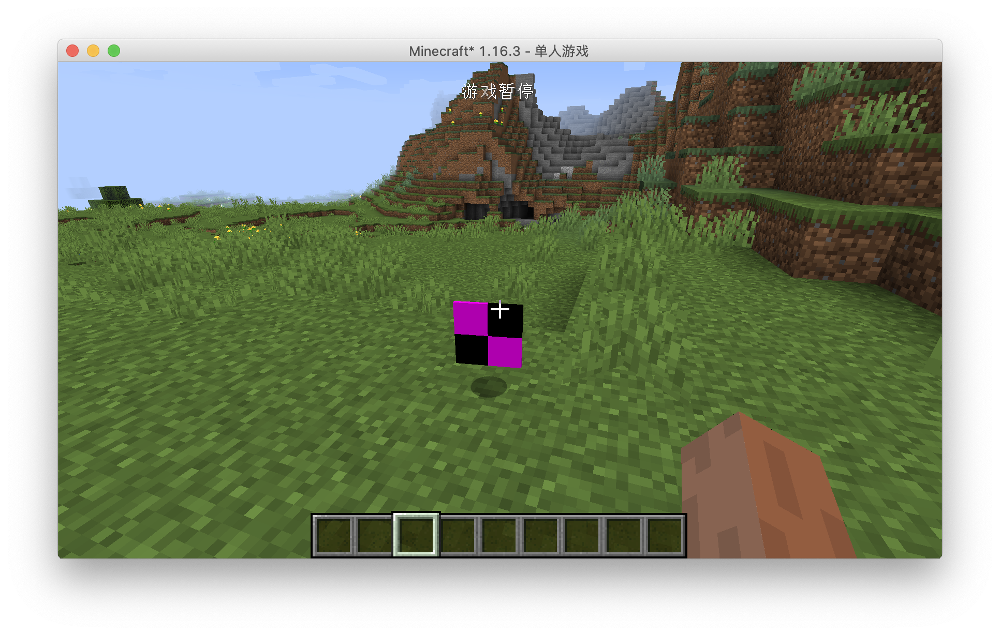

# 第一个物品

从现在开始我们就要正式开始写代码了。首先有几件事要说明，本项目的代码都会开源，每节的代码链接我都会放在文章的后面，而为了之后修正和查看方便。

首先我们得明确，创建一个物品需要哪几个步骤。答案是三步：创建自己的物品并继承原版的物品的类，实例化这个物品，最后把这个物品注册进游戏。

注意上面这些步骤是通用的，很多自定义内容的添加都是遵循着上面的步骤。

知道了上述步骤之后，我们就开始添加我们的第一个物品吧，在这里我们将添加一个黑曜石碇。

首先我们需要创建一个物品的类，并且让这个类继承原版的`Item`类。

```java
public class ObsidianIngot extends Item {
    public ObsidianIngot() {
        super(new Properties().group(ItemGroup.MATERIALS));
    }
}
```

这个类的代码非常简单，只有一个构造函数。

这里唯一值得一说的就是`new Properties().group(ItemGroup.MATERIALS)`，这个`Properties`规定了物品的一些属性，比如：是不是食物，或者这个物品在创造模式的哪一个物品栏。

在这里我们创建了一个`Properties`并且调用了`group`方法然后传入了`ItemGroup.MATERIALS`，这样做是将物品添加进，原版「杂项」创造模式物品栏里。当然你也可以不调用 `group`方法，如果这样就只能通过`/give`命令才能获取到物品了。

接下去我们需要实例化和注册这个物品，在以前这个是分开的两步，但是Forge加入了一个叫做`DeferredRegister`的机制，使得注册一个物品变得非常的简单。

```java
public class ItemRegistry {
    public static final DeferredRegister<Item> ITEMS = DeferredRegister.create(ForgeRegistries.ITEMS, Utils.MOD_ID);
    public static final RegistryObject<Item> obsidianIngot = ITEMS.register("obsidian_ingot", ObsidianIngot::new);
}

```

这就是注册的全部内容，首先我们创建了一个类型为`DeferredRegister<Item>`名字叫做`ITEMS`的变量，这个泛型表明我们需要注册的东西是物品，然后通过`new DeferredRegister<>(ForgeRegistries.ITEMS, Utils.MOD_ID);`实例化了这个类，这个类里有两个参数`ForgeRegistries.ITEMS`代表了我们要注册的是物品，第二个参数填入的应该是你的`modId`。这样我们就创建好了注册器，接下去就是注册我们的物品。

还记得我之前说过的吗？注册需要两个东西，一个是「注册名」，还有一个就是你要注册对象的实例，`ITEMS.register`里的两个参数就是分别对应了这两个东西。

```java
public static final RegistryObject<Item> obsidianIngot = ITEMS.register("obsidian_ingot", ObsidianIngot::new);
```

第一个参数很好理解，`”obsidian_ingot”`就对应着注册名，请注意这里的注册名也不要用大写字母，因为这里的第二个参数需要的类型是一个`Supplier`，这里我们直接放上了`ObsidianIngot`类的构造方法的方法引用上去，如果你对这个语法不熟悉，请先至少弄明白Java8的函数式编程相关的内容。

你看，虽然我们没有显式声明变量，但是我们还是在注册时实例化了我们物品的类。

还差最后一步，我们就可以成功添加物品了。

```java
@Mod(Utils.MOD_ID)
public class Neutrino {
    public Neutrino() {
        ItemRegistry.ITEMS.register(FMLJavaModLoadingContext.get().getModEventBus());
    }
}
```

我们在`Mod`主类的构建方法里添加了一行代码，`FMLJavaModLoadingContext.get().getModEventBus()`这句话的意思是获取`Mod`总线，如果你不知什么是`Mod`总线请向前翻阅。而`ITEMS.register(FMLJavaModLoadingContext.get().getModEventBus());`的意思就是将`ITEMS`注册进`Mod`总线里。为什么要注册进`Mod`总线里呢？原因是，`DeferredRegister`是基于事件系统实现的。

到这里，我们要添加的物品所需的代码已经写完了，打开游戏看看吧。




虽然这个物品还是很丑，但这就是我们第一个物品了。

[源码链接](https://github.com/FledgeXu/BosonSourceCode/tree/master/src/main/java/com/tutorial/boson/first_item)